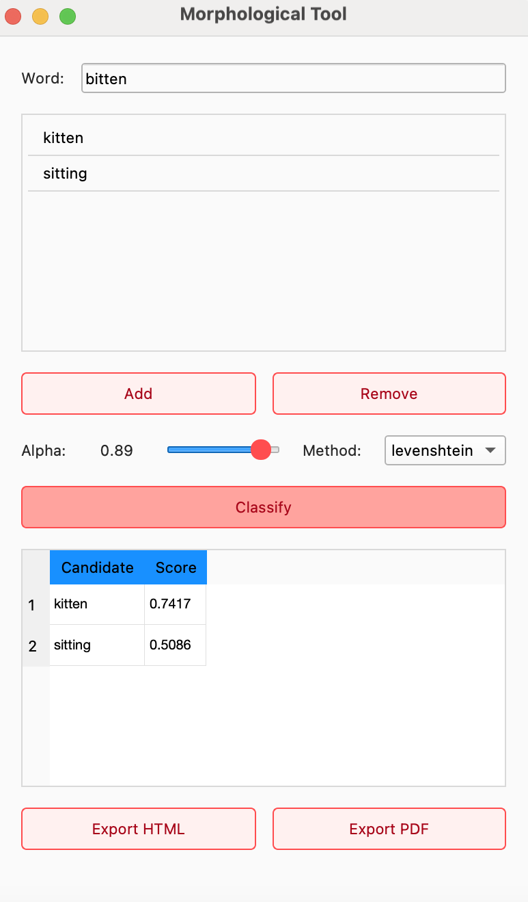
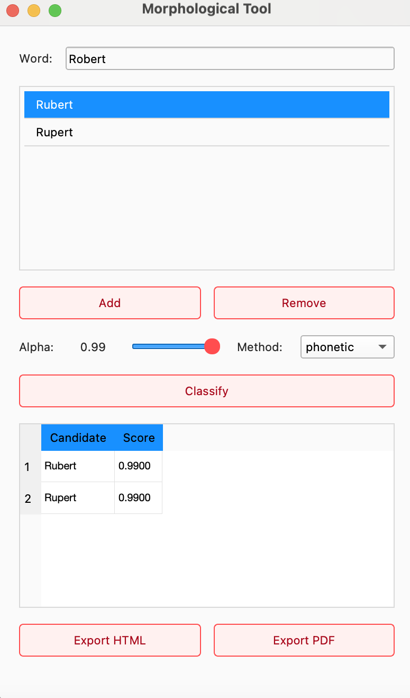

# Morphological Tool

Morphological Tool is a lightweight, Python-powered desktop application for exploring and comparing morphological variants of words. With a clean PyQt5 GUI, you can:

- **Enter** a base form (e.g. “analysis”, “bitten”, “Robert”)  
- **Add** any number of candidate affixes or alternate inflections  
- **Adjust** an “α” weight slider to control how strongly similarity drives your ranking  
- **Choose** between orthographic (Levenshtein) or phonetic (Soundex) similarity measures  
- **Visualize** a sorted table of similarity scores and automatically highlight the top candidate  
- **Export** your results as polished HTML or PDF reports in one click

Under the hood, the tool separates concerns into two modules:

1. **Similarity** (`backend/similarity.py`) – computes normalized edit-distance and Soundex matches, and can be easily extended with additional string or embedding-based metrics.  
2. **Classifier** (`backend/classifier.py`) – applies a simple, configurable scoring function (`score = α × similarity`) to rank candidates, with clear extension points for multi-feature or supervised models.

Whether you’re teaching morphology, prototyping an NLP pipeline, or simply curious about how words relate, Morphological Tool provides an intuitive interface and a modular codebase to experiment, visualize, and report on morphological relationships.

---

## How to use it:

  

### Prerequisites

  

- Python 3.8+

- Virtualenv (recommended)

  

### Install

  

```bash

git  clone  https://github.com/your-org/morph-tool.git

cd  morph-tool

python3  -m  venv  venv

source  venv/bin/activate  # or `venv\Scripts\activate` on Windows

pip  install  -r  requirements-dev.txt

```

## Similarity Module (`backend/similarity.py`)

  

The **Similarity** component provides a simple, yet flexible way to quantify “closeness” between any two strings. Currently it supports:

  

### 1. Levenshtein Similarity

- Computes the classic edit distance (insertions + deletions + substitutions) via dynamic programming.

- Normalizes by the maximum string length to yield a score in `[0.0 … 1.0]`, where `1.0` means the strings are identical, and `0.0` means they share no characters in common.

  

### 2. Phonetic Similarity (Soundex)

- Encodes each word with the American Soundex algorithm (first letter + three digits).

- Returns `1.0` if the two Soundex codes match exactly (i.e. they “sound” the same), otherwise `0.0`.

- Useful for catching orthographic variants that share pronunciation (e.g. `color` → `colour`).

  

#### How to extend

-  **Additional string metrics**: add Jaro–Winkler, n-gram cosine, Damerau-Levenshtein, etc., by plugging in new `_your_method(a, b)` functions and wiring them through `calculate_similarity`.

-  **Embedding-based similarity**: integrate a pretrained word-embedding model (Word2Vec / FastText / BERT) and compute cosine similarity of vector representations.

  

---

  

## Classifier Module (`backend/classifier.py`)

  

The **Classifier** ranks a set of candidate affixes or word forms by applying a simple, configurable scoring function:

  

```python

score(c) = α × similarity(base, c)

```

# Morphological Tool – UI Walkthrough

Below are two illustrative examples showing how the GUI works, step by step, using different similarity methods.

---

## 1. Core UI Components

**Word input**  
   Enter your _base form_ (e.g. `bitten`, `Robert`) into the **Word** field at the end.

**Candidates list**  
    Click **Add** to insert whatever strings you want to compare (affixes, inflections, or full words).  


**Method dropdown**  
   Choose between:
   - **levenshtein** → normalized edit‐distance  
   - **phonetic** → exact Soundex match


---

## 2. Example 1 – Levenshtein Similarity



- **Base word**: `bitten`  
- **Candidates**: `kitten`, `sitting`  
- **Alpha**: `0.89`  
- **Method**: `levenshtein`  

The tool displays those scores in the results table and selects **`kitten`** as the best match.

---

## 3. Example 2 – Phonetic (Soundex) Similarity



- **Base word**: `Robert`  
- **Candidates**: `Rubert`, `Rupert`  
- **Alpha**: `0.99`  
- **Method**: `phonetic`  

Both “Rubert” and “Rupert” share the same Soundex code, so each gets a raw similarity of `1.0`.  
With `α = 0.99`, their final scores are both `0.99`. 

---
